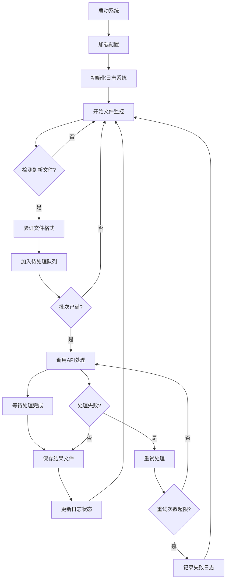

## 1. 产品概述

本项目是一个自动化视频去水印处理工具，用于监控Input文件夹中的视频文件变化，并自动调用SoraWatermarkCleaner API进行去水印处理。该工具主要解决批量视频去水印的自动化需求，提高内容创作者的工作效率。

目标用户：需要批量处理带水印视频的内容创作者、视频编辑工作者、媒体公司等。

市场价值：节省人工处理时间，实现视频去水印的自动化，支持批量处理提高工作效率。

## 2. 核心功能

### 2.1 用户角色
本系统为单用户工具，无需区分用户角色。

### 2.2 功能模块

我们的视频去水印自动化工具包含以下核心功能：

1. **文件监控模块**：实时监控Input文件夹中的视频文件变化
2. **API处理模块**：调用SoraWatermarkCleaner API进行去水印处理
3. **批处理模块**：支持分批次处理大量视频文件
4. **日志记录模块**：记录处理文件和时间，支持查询历史记录
5. **配置管理模块**：支持配置文件管理API密钥、处理参数等
6. **错误处理模块**：完善的异常处理和重试机制

### 2.3 页面详情

| 页面名称 | 模块名称 | 功能描述 |
|---------|---------|---------|
| 控制台界面 | 状态显示 | 显示当前监控状态、待处理文件数量、处理进度等实时信息 |
| 控制台界面 | 文件列表 | 显示待处理、处理中、已完成的文件列表，包含文件名、状态、处理时间等 |
| 控制台界面 | 日志查看 | 显示详细的处理日志，支持按时间、状态筛选查看 |
| 控制台界面 | 配置设置 | 设置API密钥、批处理大小、监控间隔、重试次数等参数 |
| 控制台界面 | 手动触发 | 支持手动选择文件进行去水印处理，绕过自动监控 |
| 系统核心 | 文件监控 | 实时监控Input文件夹，检测新文件、修改文件，支持文件类型过滤 |
| 系统核心 | API调用 | 调用SoraWatermarkCleaner API，支持进度回调、超时处理、重试机制 |
| 系统核心 | 批处理 | 按配置批次大小分组处理文件，避免API过载，支持并发控制 |
| 系统核心 | 日志记录 | 记录文件处理状态、API响应、错误信息，支持日志轮转和清理 |
| 系统核心 | 错误处理 | 处理网络异常、API错误、文件读写错误，支持自动重试和降级处理 |

## 3. 核心流程

### 主处理流程
1. 系统启动时初始化配置和日志系统
2. 开始监控Input文件夹，检测视频文件变化
3. 发现新文件后，验证文件格式和大小
4. 将文件加入待处理队列，按批次分组
5. 调用SoraWatermarkCleaner API进行去水印处理
6. 接收处理结果，保存到Output文件夹
7. 更新处理日志和状态
8. 继续监控下一个文件

### 批处理流程
1. 收集待处理文件到指定批次大小
2. 并发提交多个API请求（可配置并发数）
3. 监控每个请求的处理进度
4. 处理完成后保存结果文件
5. 记录每个文件的处理结果
6. 清理临时文件和更新状态

## 4. 用户界面设计

### 4.1 设计风格
- **主色调**：深蓝色 (#1e40af) 和灰色 (#6b7280)
- **按钮样式**：圆角矩形，主要操作为蓝色，次要操作为灰色
- **字体**：系统默认字体，主要文字14-16px，标题18-24px
- **布局风格**：卡片式布局，左右分栏（左侧控制面板，右侧状态显示）
- **图标风格**：简洁的线性图标，使用Unicode符号或系统图标

### 4.2 页面设计概述

| 页面名称 | 模块名称 | UI元素 |
|---------|---------|--------|
| 控制台界面 | 状态显示 | 顶部状态栏显示运行状态、已处理文件数、成功率统计，使用绿色/红色指示器 |
| 控制台界面 | 文件列表 | 表格形式显示文件信息，包含进度条、状态标签（待处理/处理中/成功/失败） |
| 控制台界面 | 日志查看 | 可滚动的日志区域，支持关键词搜索，不同级别日志使用不同颜色标识 |
| 控制台界面 | 配置设置 | 表单输入框包含API密钥、数字输入框用于批处理大小、滑块用于并发数设置 |
| 控制台界面 | 控制按钮 | 开始/停止监控按钮、手动处理按钮、清除日志按钮，主要按钮突出显示 |

### 4.3 响应式设计
- 桌面优先设计，支持最小宽度800px
- 支持窗口大小调整，布局自适应
- 支持触摸设备的基本操作

## 5. 技术规格

### 5.1 文件格式支持
- 支持的视频格式：MP4, MOV, AVI, MKV, WMV
- 最大文件大小：500MB（可配置）
- 支持的视频编码：H.264, H.265, VP8, VP9

### 5.2 API规格
- API端点：https://sora.xmanx.com/api/v1/process
- 支持的方法：POST multipart/form-data
- 超时时间：300秒（可配置）
- 重试次数：3次（可配置）

### 5.3 性能要求
- 文件监控响应时间：<1秒
- 批处理并发数：1-10个（可配置）
- 日志查询响应时间：<2秒
- 内存使用：<500MB（处理100个文件时）

### 5.4 可靠性要求
- 系统稳定性：7x24小时运行
- 数据持久性：处理记录永久保存
- 错误恢复：自动重试和降级处理
- 备份机制：配置文件和日志定期备份