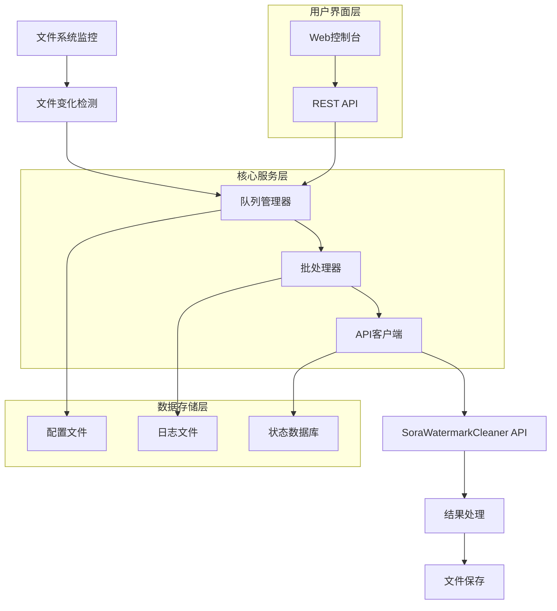
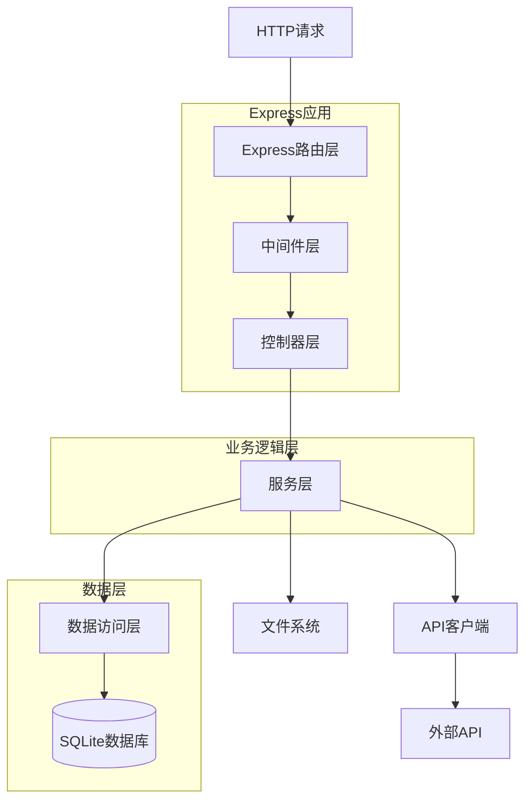
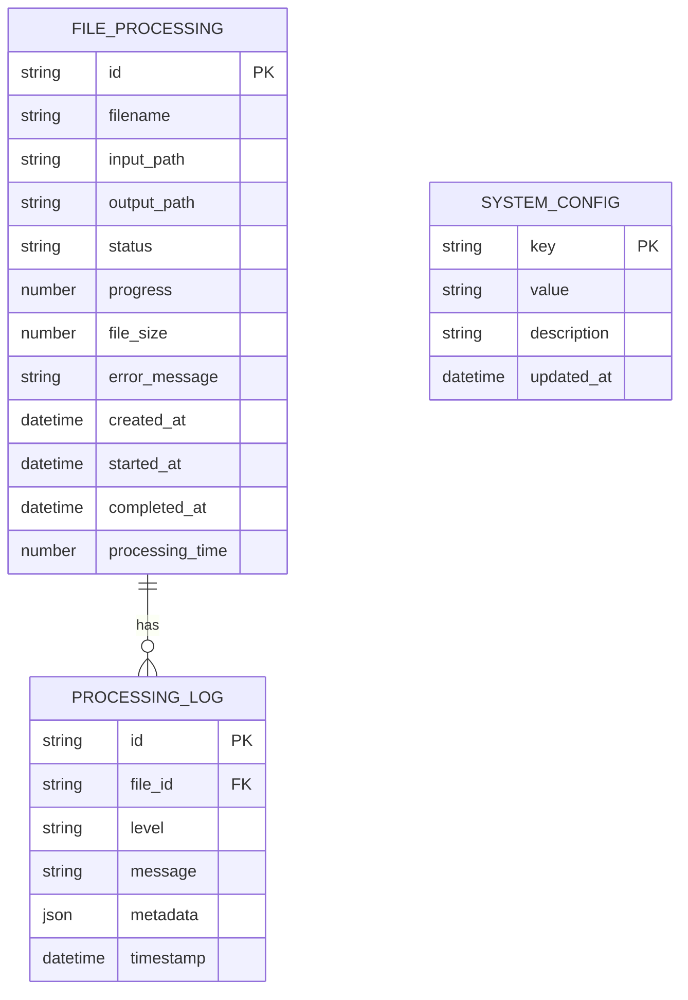

## 1. 架构设计



## 2. 技术描述

### 核心技术栈
- **运行时**: Node.js 18+
- **后端服务**: Express.js
- **文件操作**: Node fs/fs/promises
- **HTTP客户端**: axios
- **文件扫描**: 递归扫描 Input/ 子目录
- **进程管理**: 可选 PM2
- **包管理器**: npm/pnpm

### 初始化工具
- 前端初始化: vite-init
- 项目类型: React TypeScript

## 3. 路由定义（核心）

| 路由 | 目的 |
|------|------|
| / | 控制台主页，显示系统状态和文件列表 |
| /api/status | 获取系统状态（含目录与批处理统计） |
| /api/files | 获取文件列表和处理状态 |
| /api/batch/start | 启动批处理 |
| /api/batch/stop | 停止批处理 |
| /api/batch/stats | 批处理当前统计 |
| /api/batch/completed | 清理完成/失败条目（内存态） |
| /api/debug/input-files | 列出 Input 视频（排除 Input/Failed） |
| /api/debug/output-files | 列出 Output 视频 |
| /api/debug/seed | 重新扫描并入队（调试） |
| /api/system/cleanup | 删除 Input 中已有对应 Output 的源文件 |
| /api/system/fs-cleanup | 同上（别名） |
| /api/system/move-failed | 将已标记失败的源文件移动到 Failed |

## 4. API定义

### 4.1 文件处理API

**POST /api/files/upload**

上传文件进行处理

请求参数:
| 参数名 | 类型 | 必需 | 描述 |
|--------|------|------|------|
| file | File | 是 | 要处理的视频文件 |
| batch_size | number | 否 | 批处理大小，默认5 |

响应:
| 参数名 | 类型 | 描述 |
|--------|------|------|
| success | boolean | 处理是否成功 |
| file_id | string | 文件唯一标识符 |
| status | string | 处理状态 |

示例:
```json
{
  "success": true,
  "file_id": "550e8400-e29b-41d4-a716-446655440000",
  "status": "processing"
}
```

**GET /api/files/status/{file_id}**

获取文件处理状态

响应:
```json
{
  "file_id": "550e8400-e29b-41d4-a716-446655440000",
  "filename": "input_video.mp4",
  "status": "completed",
  "progress": 100,
  "output_path": "/output/clean_video.mp4",
  "processing_time": 45.2,
  "created_at": "2024-01-15T10:30:00Z",
  "completed_at": "2024-01-15T10:32:00Z"
}
```

### 4.2 行为与环境变量

- `INPUT_DIR`：输入目录
- `OUTPUT_DIR`：输出目录（输出命名 `name_clean.ext`）
- `FAILED_DIR`：失败顶层目录（保留子目录结构）
- `SERVER_PORT`：服务端口，默认 `25348`
- `JOB_TIMEOUT_MS`：单任务超时（默认10分钟）
- `POLL_TIMEOUT_MS`：下载轮询超时（默认5分钟）
- `POLL_INTERVAL_MS`：下载轮询间隔（默认3秒）
- `MIN_READY_SIZE`：输入文件最小稳定大小（默认 1024 字节）
- `AUTO_MOVE_TO_FAILED`：失败是否自动移动到 `Failed`

### 4.3 日志API

**GET /api/logs**

获取处理日志

查询参数:
| 参数名 | 类型 | 描述 |
|--------|------|------|
| start_date | string | 开始日期 (ISO 8601) |
| end_date | string | 结束日期 (ISO 8601) |
| status | string | 过滤状态 |
| limit | number | 返回记录数量限制 |

## 5. 服务器架构图（简化）



## 6. 数据模型（可选）

### 6.1 数据模型定义



### 6.2 数据定义语言

**文件处理表 (file_processing)**
```sql
CREATE TABLE file_processing (
    id TEXT PRIMARY KEY,
    filename TEXT NOT NULL,
    input_path TEXT NOT NULL,
    output_path TEXT,
    status TEXT NOT NULL CHECK (status IN ('pending', 'processing', 'completed', 'failed', 'cancelled')),
    progress INTEGER DEFAULT 0 CHECK (progress >= 0 AND progress <= 100),
    file_size INTEGER,
    error_message TEXT,
    created_at DATETIME DEFAULT CURRENT_TIMESTAMP,
    started_at DATETIME,
    completed_at DATETIME,
    processing_time REAL,
    retry_count INTEGER DEFAULT 0
);

CREATE INDEX idx_file_processing_status ON file_processing(status);
CREATE INDEX idx_file_processing_created_at ON file_processing(created_at);
CREATE INDEX idx_file_processing_filename ON file_processing(filename);
```

**处理日志表 (processing_log)**
```sql
CREATE TABLE processing_log (
    id TEXT PRIMARY KEY,
    file_id TEXT NOT NULL,
    level TEXT NOT NULL CHECK (level IN ('info', 'warning', 'error', 'debug')),
    message TEXT NOT NULL,
    metadata TEXT,
    timestamp DATETIME DEFAULT CURRENT_TIMESTAMP,
    FOREIGN KEY (file_id) REFERENCES file_processing(id) ON DELETE CASCADE
);

CREATE INDEX idx_processing_log_file_id ON processing_log(file_id);
CREATE INDEX idx_processing_log_timestamp ON processing_log(timestamp);
CREATE INDEX idx_processing_log_level ON processing_log(level);
```

**系统配置表 (system_config)**
```sql
CREATE TABLE system_config (
    key TEXT PRIMARY KEY,
    value TEXT NOT NULL,
    description TEXT,
    updated_at DATETIME DEFAULT CURRENT_TIMESTAMP
);

-- 初始化配置数据
INSERT INTO system_config (key, value, description) VALUES 
('api_key', '', 'SoraWatermarkCleaner API密钥'),
('batch_size', '5', '批处理大小'),
('concurrent_limit', '3', '并发处理限制'),
('timeout', '300', 'API请求超时时间(秒)'),
('retry_count', '3', '失败重试次数'),
('monitor_interval', '1000', '文件监控间隔(毫秒)'),
('max_file_size', '524288000', '最大文件大小(字节)'),
('output_format', 'mp4', '输出视频格式'),
('quality', 'high', '输出视频质量');
```

## 7. 核心模块设计

### 7.1 文件监控模块
- 使用chokidar库实现跨平台文件监控
- 支持递归监控子目录
- 文件变化事件：add, change, unlink
- 防抖处理避免重复触发
- 文件类型和大小过滤

### 7.2 API客户端模块
- 基于axios的HTTP客户端
- 自动重试机制
- 请求超时控制
- 进度回调支持
- 错误处理和降级策略

### 7.3 批处理管理器
- 队列管理：先进先出
- 并发控制：可配置并发数
- 批次分组：按配置大小分组
- 进度跟踪：实时更新处理进度
- 失败处理：重试和错误记录

### 7.4 日志系统
- 结构化日志输出
- 多级别日志：debug, info, warning, error
- 日志轮转：按日期和大小分割
- 日志查询：支持时间范围和条件过滤
- 日志导出：支持多种格式导出

## 8. 部署配置

### 8.1 环境要求
- Node.js >= 18.17.1
- 内存：至少2GB
- 存储：至少10GB可用空间
- 网络：稳定的互联网连接

### 8.2 进程管理
使用 PM2（可选）：
```json
{
  "apps": [{
    "name": "sora-watermark-remover",
    "script": "./dist/server.js",
    "instances": 1,
    "exec_mode": "fork",
    "env": {
      "NODE_ENV": "production",
      "PORT": 3000
    },
    "error_file": "./logs/err.log",
    "out_file": "./logs/out.log",
    "log_file": "./logs/combined.log",
    "time": true
  }]
}
```

### 8.3 安全配置
- API密钥加密存储
- 文件访问权限控制
- 输入验证和 sanitization
- CORS配置
- 请求频率限制
